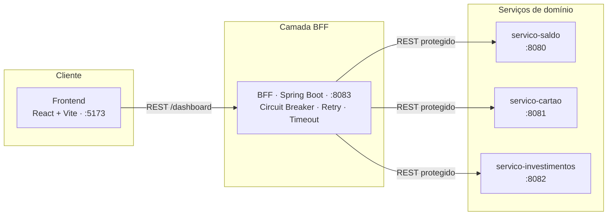

# Itaú Resilience BFF

Demonstração prática de **resiliência em microsserviços**: um Super App bancário que
continua **parcialmente funcional** quando uma dependência falha, em vez de cair por
inteiro. O padrão **BFF (Backend for Frontend)** centraliza a orquestração e a
resiliência (**Circuit Breaker + Retry + Timeout**, via Resilience4j) num só lugar.

[](https://github.com/ximenesdev/itau-resilience-bff/actions/workflows/ci.yml)


> **Aviso:** projeto **educacional/de portfólio**, **sem qualquer afiliação** com o
> Itaú Unibanco S.A. A marca "Itaú" e o laranja são usados apenas como cenário visual
> de estudo. Nenhum dado é real. Veja o [Disclaimer](#-disclaimer).

---

## 📑 Índice
- [Visão geral](#-visão-geral)
- [Arquitetura](#-arquitetura)
- [Stack](#-stack)
- [Destaque técnico: o Retry que estava "morto"](#-destaque-técnico-o-retry-que-estava-morto)
- [Quick start](#-quick-start)
- [Endpoints do BFF](#-endpoints-do-bff)
- [Estrutura do repositório](#-estrutura-do-repositório)
- [Documentação](#-documentação)
- [Disclaimer](#-disclaimer)
- [Licença](#-licença)

---

## 🎯 Visão geral

O frontend consome **um único endpoint** do BFF (`/dashboard`), que por baixo chama
**três serviços de domínio** (saldo, cartão e investimentos) em paralelo. Cada chamada
é protegida por Circuit Breaker, Retry e Timeout. Se um serviço cai ou fica lento, o
BFF devolve um **fallback** para aquele pedaço e o restante do painel continua vivo — o
usuário nunca vê a tela inteira quebrar por causa de uma dependência.

A tela **Resiliência** permite **injetar falhas ao vivo** (erro 500 ou lentidão) e ver o
circuito abrir (`OPEN`), bloquear chamadas, e depois se recuperar (`HALF_OPEN` → `CLOSED`).

## 🏗 Arquitetura



| Serviço                  | Porta | Papel                                             |
| ------------------------ | ----- | ------------------------------------------------- |
| `servico-saldo`          | 8080  | Serviço de domínio — saldo da conta               |
| `servico-cartao`         | 8081  | Serviço de domínio — fatura do cartão             |
| `servico-investimentos`  | 8082  | Serviço de domínio — carteira de investimentos    |
| `bff`                    | 8083  | Agrega os 3 e aplica os padrões de resiliência    |
| `frontend`               | 5173  | SPA React (Vite) — painel de operações            |

## 🧰 Stack

| Camada       | Tecnologia                                             |
| ------------ | ------------------------------------------------------ |
| Linguagem    | Java 25                                                |
| Framework    | Spring Boot 4.0.6 (Spring Framework 7)                 |
| Resiliência  | Resilience4j 2.4.0 (`resilience4j-spring-boot4`)       |
| Build        | Gradle (multi-módulo) + wrapper                        |
| Observabilidade | Spring Boot Actuator                               |
| Frontend     | React 19 · Vite 8 · React Router 7 · Axios · Framer Motion |
| Containers   | Docker (multi-stage) + Docker Compose                  |

## 🔬 Destaque técnico: o Retry que estava "morto"

Durante a validação, descobri que o `maxAttempts: 2` do Retry **não tinha efeito nenhum**
— era configuração morta. A causa está na **ordem dos aspectos** AOP do Resilience4j.

Por padrão, o Retry é o aspecto **mais externo**:

```
Retry ( CircuitBreaker ( TimeLimiter ( chamada ) ) )   ❌
```

Como o **fallback vive no `@CircuitBreaker`**, o CB engole a falha e devolve o fallback
como **resultado de sucesso**. O Retry, por estar **por fora**, só enxerga "sucesso" e
**nunca tenta de novo**. Provei isso lendo as métricas do próprio Retry:
`successfulCallsWithoutRetryAttempt = 1` (1 sucesso, 0 retentativas) — mesmo com o
serviço falhando.

A correção foi **inverter a ordem** para o Circuit Breaker ser o mais externo:

```
CircuitBreaker ( Retry ( TimeLimiter ( chamada ) ) )   ✅
```

feita via *aspect order* no `application.yml` (no Spring, **menor número = mais externo**):

```yaml
circuitbreaker: { circuitBreakerAspectOrder: 1 }   # mais externo (guarda o fallback)
retry:          { retryAspectOrder: 2 }            # no meio → vê a falha crua e re-tenta
timelimiter:    { timeLimiterAspectOrder: 3 }      # mais interno → timeout por tentativa
```

Ganhos: o Retry passa a ver a **falha crua** e realmente re-tenta; o disjuntor conta
**requisições lógicas** (uma falha após esgotar retries = 1 falha no CB, sem distorção);
e cada tentativa tem seu próprio timeout. Há **teste automatizado** provando que o Retry
refaz a chamada e que o CB registra só 1 falha por requisição.

> A explicação completa (com perguntas de entrevista) está em
> [`PERGUNTAS-ENTREVISTA.md`](PERGUNTAS-ENTREVISTA.md).

## 🚀 Quick start

### Pré-requisitos
- **JDK 25** (o wrapper do Gradle cuida da versão do Gradle)
- **Node.js 20.19+ ou 22.12+** e npm (para o frontend)
- **Docker** + **Docker Compose** (opcional — só para o caminho containerizado)

### Opção A — Docker (backend em containers)
Na raiz do projeto:
```bash
docker compose up --build
```
Sobe os 4 serviços backend na ordem correta (os 3 de domínio primeiro; o BFF só quando
eles estão saudáveis). Depois, o frontend em outro terminal:
```bash
cd frontend
npm install
npm run dev
```
Detalhes e troubleshooting em [`docs/COMO-RODAR-DOCKER.md`](docs/COMO-RODAR-DOCKER.md).

### Opção B — Local (sem Docker)
Um terminal para cada serviço backend (Linux/macOS; no Windows use `gradlew.bat`):
```bash
./gradlew :backend:servico-saldo:bootRun
./gradlew :backend:servico-cartao:bootRun
./gradlew :backend:servico-investimentos:bootRun
./gradlew :backend:bff:bootRun
```
E o frontend:
```bash
cd frontend && npm install && npm run dev
```
O app abre em `http://localhost:5173` e conversa com o BFF em `localhost:8083`.

## 🔌 Endpoints do BFF

| Método | Rota                                        | Descrição                                    |
| ------ | ------------------------------------------- | -------------------------------------------- |
| `GET`  | `/dashboard`                                | Dados agregados (saldo + cartão + investimentos) |
| `GET`  | `/resiliencia/circuitos`                    | Estado de cada Circuit Breaker               |
| `POST` | `/resiliencia/falha/{servico}/ativar`       | Injeta falha (`?modo=erro` ou `?modo=lentidao`) |
| `POST` | `/resiliencia/falha/{servico}/desativar`    | Remove a falha injetada                      |
| `GET`  | `/resiliencia/falha/status`                 | Situação atual das falhas injetadas          |
| `GET`  | `/actuator/health` · `/actuator/circuitbreakers` | Saúde e estado dos disjuntores (Actuator) |

## 📂 Estrutura do repositório

```
.
├── backend/
│   ├── bff/                     # Backend for Frontend (orquestra + resiliência)
│   ├── servico-saldo/           # Serviço de domínio
│   ├── servico-cartao/          # Serviço de domínio
│   └── servico-investimentos/   # Serviço de domínio
├── frontend/                    # SPA React + Vite
├── docker/Dockerfile            # Dockerfile multi-stage reutilizável
├── compose.yml                  # Orquestração dos 4 serviços backend
├── build.gradle · settings.gradle   # Build Gradle multi-módulo
├── docs/                        # Guias: Docker e demonstração de resiliência
└── PERGUNTAS-ENTREVISTA.md      # Perguntas e respostas técnicas de entrevista
```

## 📚 Documentação
- [`docs/COMO-RODAR-DOCKER.md`](docs/COMO-RODAR-DOCKER.md) — subir tudo com Docker Compose
- [`docs/DEMO.md`](docs/DEMO.md) — reproduzir a demonstração de resiliência ao vivo
- [`PERGUNTAS-ENTREVISTA.md`](PERGUNTAS-ENTREVISTA.md) — decisões técnicas em profundidade
- [`frontend/README.md`](frontend/README.md) — detalhes do módulo de frontend

## ⚖️ Disclaimer

Este é um **projeto educacional e de portfólio**, criado para estudo de padrões de
resiliência em sistemas distribuídos. **Não possui qualquer afiliação, patrocínio ou
endosso do Itaú Unibanco S.A.** As referências visuais à marca "Itaú" servem apenas como
cenário realista de estudo; todos os dados exibidos são fictícios. Todas as marcas
pertencem aos seus respectivos donos.

## 📜 Licença

Distribuído sob a licença **MIT**. Veja [`LICENSE`](LICENSE).
